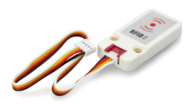
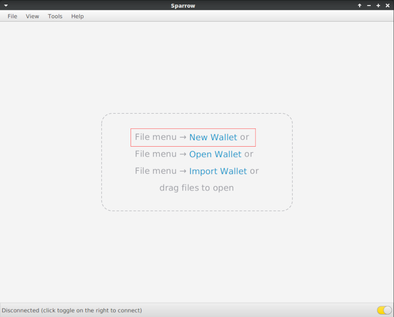
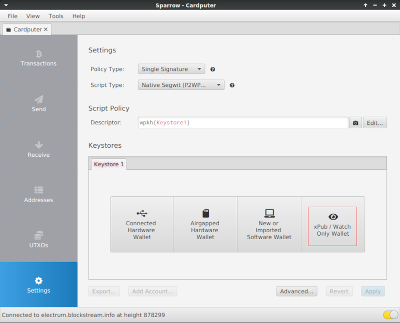
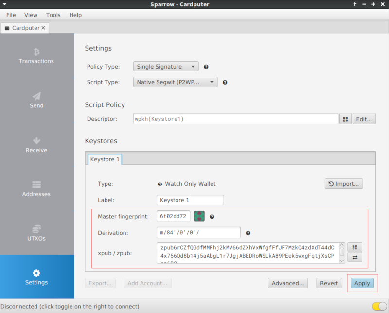
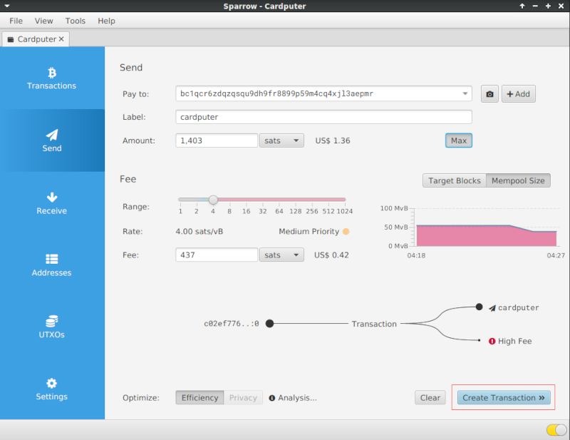
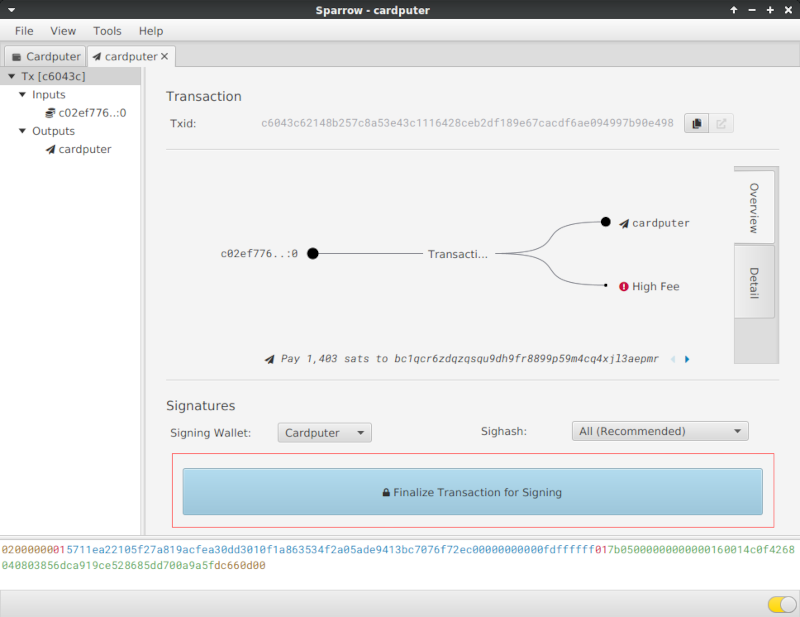
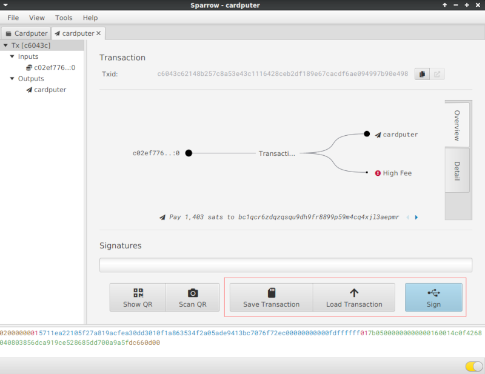
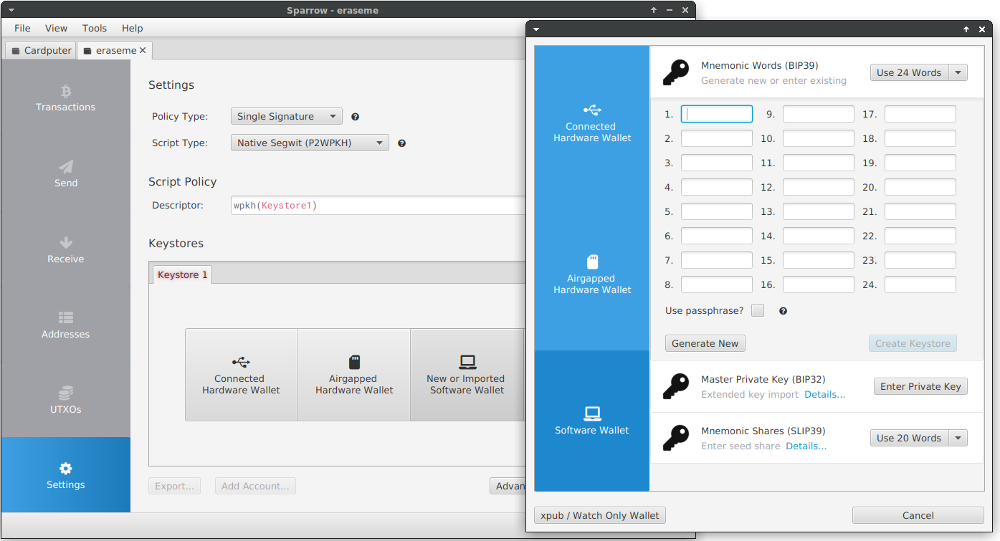

# Bitcoin Card Wallet

**Bitcoin Card Wallet** is an ESP32 project that **allows you to generate seeds, addresses, and sign transactions.** It offers key generation based on **BIP39 standards**, allowing the user to generate a mnemonic **24 words seed** that can be safely backed up and restored in **compatible wallets.**. The seed is **never stored on the device itself**, and to sign a transaction, you must enter the seed words or use an RFID tag to store it.


- **Manage Wallets**: create seeds, public key, mnemonic words, balance
- **Transaction Signing:** Sign Bitcoin transactions directly on the device using your seed or RFID tag.
- **Seed Storage on RFID Tags:** Store your seed securely on an RFID MIFARE 1K tag (optionnal).
- **Encrypted Seed Backup:** Encrypt and store your seed on RFID tags for enhanced protection.
- **Seed Restoration:** restore your seed from RFID tags,or by manually entering mnemonic words.
- **Transaction File Handling:** Sign and export PSBT transaction files directly on the device.
- **QR Code**: Generate and display QR codes for easy sharing of Bitcoin and balance addresses.
- **USB Typing**: Emulate a USB keyboard to type out Bitcoin addresses.
- **SD Card**: Support for SD card storage to save and retrieve wallet data and saving PSBT file.
- **Passphrase**: Generate and use seeds with an optional passphrase for enhanced security.

## Installation

- <b>M5Burner</b> : Search into M5CARDPUTER section and burn it
- <b>Old school</b> : Build or take the firmware.bin from the [github release](https://github.com/geo-tp/Bitcoin-Card-Wallet/releases) and flash it

## Saving Wallets Using the SD Card

An SD card is require to save **wallets publics informations** and load them at the launch of the application. Only public informations about your wallets are stored on the SD card, **SAVE YOUR SEED** or you will lose access to your bitcoin wallet.

The following informations will be stored on SD card in the file `card-wallets.txt` : 

- ***Wallet name***
- ***Public Key***
- ***Bitcoin address***
- ***Derivation path***
- ***Fingerprint***

You can **manually edit this file** to add others bitcoin addresses or remove existing ones

```
Filetype: Card Wallet
Version: 2

# WALLET 1
Name: Geo Wallet
zPub: zpub6rCZfQGdfMMFhj2kMV66dZXhVxWfgfFfJF7MzkQ4zdXdT44dC4x756Qd8b14j5aAbgL1r7JgjABEDRoWSLkA89PEek5wxgFqtjXsCPgp6BQ
BitcoinAddress: bc1qcr6zdqzqsqu9dh9fr8899p59m4cq4xjl3aepmr
DerivationPath: m/84'/0'/0'/
Fingerprint: 6f022fd


# WALLET 2
...

```

## Saving the Seed Using RFID
When you create or restore a wallet you have the option **to save your seed** on an RFID tag. **This does not replace the necessity of writing down the words manually.**


**NOTE: You can save an existing wallet on an RFID tag** by using the **"RESTORE SEED"** option and write your seed words. **It will prompt you to save your seed on the RFID tag** during the restoration process.

### Prerequisites

- You have the **M5Stack RFID2 module.**
- 
- You have **MIFARE 1K tag**. The tag **must be empty (blank).**
- 

### You can save your seed in two ways:

- **Plaintext:** The seed is stored in plaintext on the RFID tag.
- **Encrypted:** The seed is encrypted with a passphrase and saved on the RFID tag. This ensures higher security.

### Step-by-Step Instructions

1. During the wallet creation process, choose to save your seed on an RFID tag.

2. Ensure your RFID2 module is plugged in, and place the tag on the reader when prompted.

3. Choose whether or not to encrypt your seed backup on the tag. If you choose encryption, you will choose a password, the application will require you to decrypt it with the password before use.

4. Once your seed is saved on the tag, **you can use it to sign your transactions or even restore your wallet.**

**NOTE :** Encryption is **recommended for better security**, especially when storing sensitive information like a seed. Each **MIFARE 1K tag can hold one seed at a time**. Always test the tag after saving by **restoring the seed with RFID** to confirm that it was saved correctly.


## Signing Methods

**The seed is not stored on the Cardputer**, so it must be loaded from an RFID tag, entered manually, or retrieved from a backup file on the SD card to sign a transaction

- **Using an RFID Tag (Recommended):** Sign transactions securely by reading the seed stored on an RFID tag. Encryption is recommended for added security.

- **Entering Seed Words Manually:** Enter your 12 or 24 seed words manually when prompted to sign the transaction.

- **Using a Seed Backup File (Not Recommended):** Load a 12-24 words backup txt file from the SD card to sign the transaction. This method should only be used as a last resort.

**Note:** Storing your seed on an SD card is **not secure and increases the risk of theft or accidental exposure**.

### Step-by-Step Instructions

1. Load your wallets and select the one you want to sign with.

2. Load your seed using your preferred method.

3. Select the **.psbt transaction file**, add your passphrase if necessary, and the Cardputer will sign it.

**NOTE : The signed transaction file will be saved on the SD card with the suffix "-signed"** in the same folder as unsigned file, and you can then import it.

## Watch-only wallet in Sparrow

You can import your zpub key into Sparrow to create a **"Watch-only wallet"**. A watch-only wallet allows you to view balances and transactions **without having access to the private keys**, making it ideal for monitoring funds securely.

[Sparrow Wallet Official Website](https://sparrowwallet.com/)

1. Open Sparrow, select **"New wallet"**
- 
2. Select **"xPub Watch Only Wallet"**
- 
3. Type your fingerprint, derivation path and zpub, **you can use USB auto typing**, all these informations are **in your wallet informations on the cardputer.** And then, click on **"Apply"**.
- 
4. Your Watch only wallet is now created, **you can fetch your balance by toggling the switch on the right corner**

**NOTE : You can use this watch-only wallet to prepare your transactions**, which you can then transfer to your **Cardputer for signing**. Make sure to use the right seed for the right transaction.

## Transactions in Sparrow

How to export the unsigned transation and import the signed transaction in Sparrow

[Sparrow Wallet Official Website](https://sparrowwallet.com/)

1. Go to **"Send"**, prepare your transaction (address, label, amount) and click **"Create Transaction"**
- 
2. Your transaction is created, click on **"Finalize Transaction for Signing"**
- 
3. You can see your transaction resume, click on "**Save**" to get the .psbt file, **sign it with you cardputer by using SD card** and import the signed transaction with **"Load"**.
- 

**NOTE: The cardputer will create a new signed file with the "-signed" mention in the same path.**

## Seed Import in Sparrow

You can also use Sparrow as a standard wallet by writing down the **24 words provided when creating your seed.**

- 


## Seed Import in Electrum

Bitcoin Card Wallet generates a BIP39-compliant seed phrase that you can use to restore your wallet in Electrum.

[Electrum Wallet Official Website](https://electrum.org/)

1. Open Electrum and select **"Standard wallet"**
- 
2. Select **"I already have a seed"** and click next.
- 
3. Click on **"Options"** and select BIP39 seed, **write the 24 words**
- 
- 
5. If you used a passphrase, **ensure to check the extended word checkbox** to access the correct wallet.
- 
6. If you have a passphrase, the **passphrase must be entered** after typing the 24 words
- 
7. Electrum will automatically derive the keys and addresses following the **BIP84 (m/84'/0'/0') standard**, which is used by this wallet for **native SegWit** (Bech32) addresses.
- 


## Passphrase

The passphrase is an optional feature that adds an extra layer of security to your wallet. When set, it is combined with your BIP39 seed to generate a unique set of keys. 

**Without the correct passphrase, the wallet cannot access the same addresses or funds**, so it is crucial to remember or securely store it.

## BIP39 Mnemonic Support:
  - The private key is converted into a **BIP39-compliant** mnemonic phrase.
  - The wallet generates seeds in compliance with the BIP39 standard.
  - Supports **24-word mnemonics**.
  - Mnemonics can be restored in other **BIP39-compatible wallets** (Electrum for example).

#### Example of a 24 words BIP39 Mnemonic seed generated on the cardputer
`dragon reform deer execute fee tattoo wall barely loan jealous require student pipe bamboo solve toilet latin bargain escape spray scan stay father utility`

## Native SegWit Support:
  - Derives **Native SegWit** Bitcoin addresses by default.
  - The wallet uses the **BIP84 standard to derive keys**, following the path m/84'/0'/0' for Bitcoin mainnet.
  - The **xpub key (extended public key) is generated in a standardized format** and allows the derivation of an unlimited number of public addresses

#### Example of my segwit bitcoin address generated on the cardputer
`bc1qcr6zdqzqsqu9dh9fr8899p59m4cq4xjl3aepmr`

## Random Number Generator

In the Bitcoin Card Wallet project, **random number generation is a critical component** for creating secure private keys and ensuring the overall security of the wallet.

The project uses **multiple sources of entropy to generate random numbers**, which are then combined to form a single private key.

**Hardware, software, and user sources are used** to ensure high randomness in the private key generation process.

### Three sources of entropy

```cpp
// mbedTLS's Deterministic Random Bit Generator seeded with hardware generated entropy and a custom string
std::vector<uint8_t> CryptoService::generateRandomMbetls(size_t size) {
    // Init context
    mbedtls_ctr_drbg_context ctr_drbg;
    mbedtls_entropy_context entropy;
    mbedtls_ctr_drbg_init(&ctr_drbg);
    mbedtls_entropy_init(&entropy);

    // Seed the DRBG
    const char *pers = "cardputer_card_wallet_random_generator";
    mbedtls_ctr_drbg_seed(&ctr_drbg, mbedtls_entropy_func, &entropy,
                          reinterpret_cast<const unsigned char*>(pers),
                          strlen(pers));

    // Get random
    std::vector<uint8_t> randomData(size);
    mbedtls_ctr_drbg_random(&ctr_drbg, randomData.data(), size);

    // Release context
    mbedtls_ctr_drbg_free(&ctr_drbg);
    mbedtls_entropy_free(&entropy);

    return randomData;
}

// Hardware Random Number Generator (HRNG) to produce random numbers from hardware
std::vector<uint8_t> CryptoService::generateRandomEsp32(size_t size) {
    // Get entropy from esp32 HRNG
    std::vector<uint8_t> randomData(size);
    bootloader_random_enable();
    esp_fill_random(randomData.data(), randomData.size());
    bootloader_random_disable();
    
    return randomData;
}

// Software based random numbers
std::vector<uint8_t> CryptoService::generateRandomBuiltin(size_t size) {
    // Builtin esp_random
    std::vector<uint8_t> randomData(size);
    size_t i = 0;

    while (i < size) {
        // 32 bits integer
        uint32_t randVal = esp_random();

        // Split randVal into 4 parts
        size_t bytesToCopy = std::min(size - i, static_cast<size_t>(4));
        memcpy(randomData.data() + i, &randVal, bytesToCopy);

        i += bytesToCopy;
    }

    return randomData;
}
```

### Collecting entropy from user inputs 
```cpp
void EntropyContext::tick() {
    auto now = std::chrono::high_resolution_clock::now();

    // Calculate the delta between the last input tick and now
    if (lastTickTime.time_since_epoch().count() != 0) {
        auto delta = std::chrono::duration_cast<std::chrono::nanoseconds>(now - lastTickTime).count();
        add(delta);
    }

    lastTickTime = now; // Update the last tick time
}
```

### Mixed and hashed to form the final private key
```cpp
std::vector<uint8_t> CryptoService::generatePrivateKey(size_t keySize) {
    // Get entropy from hardware and software
    auto entropyEsp32 = generateRandomEsp32(keySize);
    auto entropyMbedtls = generateRandomMbetls(keySize);
    auto entropyBuiltin = generateRandomBuiltin(keySize);

    // Get entropy from user action
    auto entropyUser = entropyContext.getAccumulatedEntropy();

    // Control size
    if (entropyEsp32.size() != keySize || entropyMbedtls.size() != keySize || entropyBuiltin.size() != keySize) {
        throw std::runtime_error("Failed to generate sufficient entropy");
    }

    // Process SHA256 on the user entropy
    auto hashedEntropyUser = hashSha256(entropyUser, keySize);

    // Mix entropy with XOR
    auto mixedKey = mixEntropy(entropyMbedtls, entropyEsp32, 
                                               entropyBuiltin, hashedEntropyUser);
    // Process SHA256 on the result
    auto privateKey = hashSha256(mixedKey, keySize);

    return privateKey;
}
```

## License and Disclaimer
This project is provided under the MIT License, allowing free use, modification, and distribution under its terms. By using this software, you agree to the following:

- **No Warranty**: This software is provided "as is," without any warranties of any kind, whether express or implied. This includes, but is not limited to, fitness for a particular purpose, security, or absence of defects.
- **No Liability**: The authors and contributors of this software are not responsible for any loss, damage, or claims arising from the use of this software. This includes but is not limited to financial loss, theft of funds, or failure of the application to perform as intended.
- **User Responsibility**: It is your responsibility to safely back up your seed phrase, private keys, and any other sensitive information generated by this software. The seed phrase is not saved on the device, and loss of this information will result in the inability to access funds.
- **Personal Use**: This software is intended for educational and personal use only.

***By using this software, you acknowledge and accept these terms.***