# Bitcoin Card Wallet

**Bitcoin Card Wallet** is an ESP32 project that **allows you to generate seeds, addresses, and  manage Bitcoin wallets.** It offers key generation based on **BIP39 standards**, allowing the user to generate a mnemonic **24 words seed** that can be safely backed up and restored in **compatible wallets.**

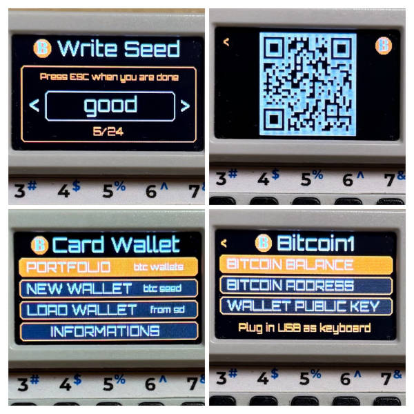


- **Manage Wallets**: create seeds, public key, mnemonic words, balance
- **QR Code**: Generate and display QR codes for easy sharing of Bitcoin and balance addresses.
- **USB Typing**: Emulate a USB keyboard to type out Bitcoin addresses.
- **SD Card**: Support for SD card storage to save and retrieve wallet data.
- **Passphrase**: Generate and use seeds with an optional passphrase for enhanced security.

## Installation

- <b>M5Burner</b> : Search into M5CARDPUTER section and burn it
- <b>Old school</b> : Build or take the firmware.bin from the [github release](https://github.com/geo-tp/Bitcoin-Card-Wallet/releases) and flash it

## How to use

1. Navigate to the **"NEW WALLET"** option.
- 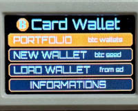
2. Record the displayed mnemonic safely (on paper, **not digitally**), you can choose a passphrase.
- 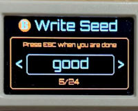
3. Use the wallet's menu to derive and display your **Bitcoin address, balance and xpub key.**
- 

**NOTE :** An SD card is require to save **wallets publics informations** and load them at the launch of the application. Only public informations about your wallets are stored on the SD card, **SAVE YOUR SEED** or you will lose access to your bitcoin wallet.

The following informations will be stored on SD card in the file `bitcoin-card-wallets.txt` : 

- ***Wallet name***
- ***Public Key***
- ***Bitcoin address***

You can **manually edit this file** to add others bitcoin addresses or remove existing ones

```
Filetype: Card Wallet
Version: 1

# WALLET 1
Name: Geo Wallet
PublicKey: zpub6rCZfQGdfMMFhj2kMV66dZXhVxWfgfFfJF7MzkQ4zdXdT44dC4x756Qd8b14j5aAbgL1r7JgjABEDRoWSLkA89PEek5wxgFqtjXsCPgp6BQ
BitcoinAddress: bc1qcr6zdqzqsqu9dh9fr8899p59m4cq4xjl3aepmr

# WALLET 2
...

```

## BIP39 Mnemonic Support:
  - The private key is converted into a **BIP39-compliant** mnemonic phrase.
  - The wallet generates seeds in compliance with the BIP39 standard.
  - Supports **24-word mnemonics**.
  - Mnemonics can be restored in other **BIP39-compatible wallets** (Electrum for example).

#### Example of a 24 words BIP39 Mnemonic seed generated on the cardputer
`dragon reform deer execute fee tattoo wall barely loan jealous require student pipe bamboo solve toilet latin bargain escape spray scan stay father utility`

## Native SegWit Support:
  - Derives **Native SegWit** Bitcoin addresses by default.
  - The wallet uses the **BIP84 standard to derive keys**, following the path m/84'/0'/0' for Bitcoin mainnet.
  - The **xpub key (extended public key) is generated in a standardized format** and allows the derivation of an unlimited number of public addresses

#### Example of my segwit bitcoin address generated on the cardputer
`bc1qcr6zdqzqsqu9dh9fr8899p59m4cq4xjl3aepmr`

## Signing transactions in Electrum

How to export, sign, and import the transaction in Electrum

[Electrum Wallet Official Website](https://electrum.org/)

### Export Transactions

1. Go to **"Send"**, prepare your transaction (address, amount) and click **"Pay"**
- 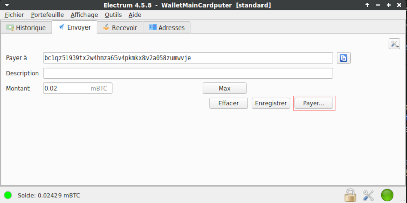
2. Select the amount of fee and click **"Preview"**
- 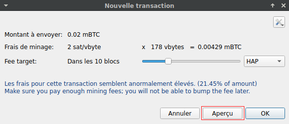
3. You can see your transaction resume, click on "**Share**"
- 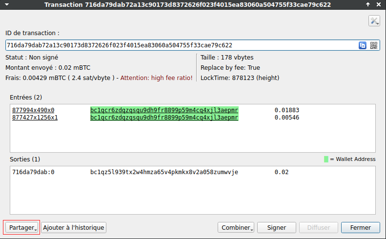
5. Check **"For hardawre device: include xpub"** and click **"Save to file"**.
- 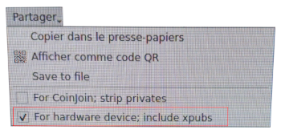

### Import Transactions

1. Click on **"Tools"** from the main menu and **select your signed .psbt file**
- 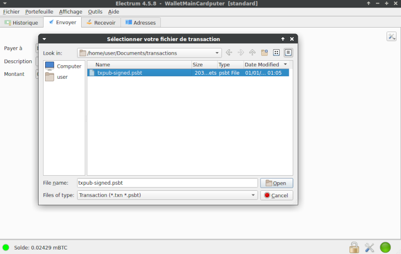

## Seed Import in Electrum

Bitcoin Card Wallet generates a BIP39-compliant seed phrase that you can use to restore your wallet:

[Electrum Wallet Official Website](https://electrum.org/)

1. Open Electrum and select **"Standard wallet"**
- 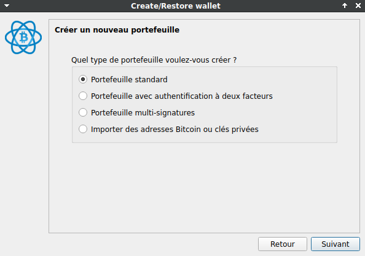
2. Select **"I already have a seed"** and click next.
- 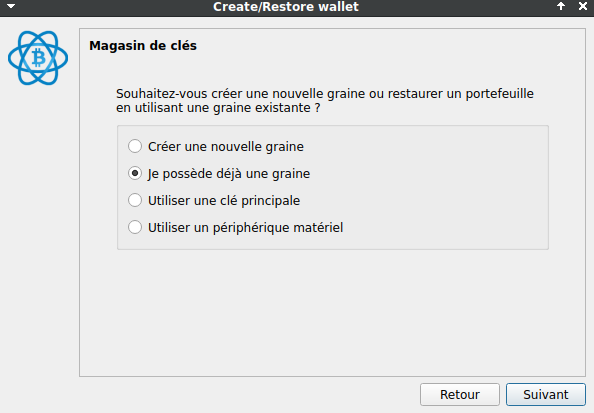
3. Click on **"Options"** and select BIP39 seed, **write the 24 words**
- 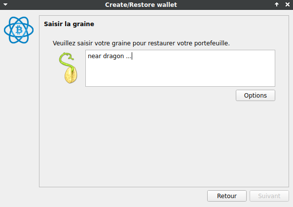
- 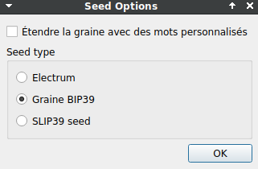
5. If you used a passphrase, **ensure to check the extended word checkbox** to access the correct wallet.
- 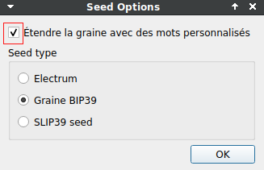
6. If you have a passphrase, the **passphrase must be entered** after typing the 24 words
- 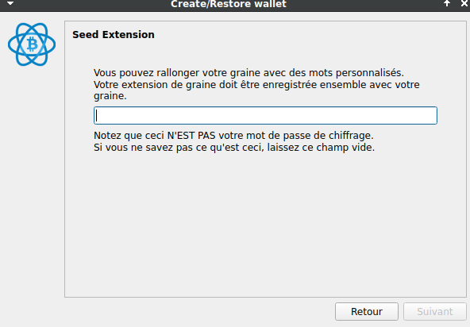
7. Electrum will automatically derive the keys and addresses following the **BIP84 (m/84'/0'/0') standard**, which is used by this wallet for **native SegWit** (Bech32) addresses.
- 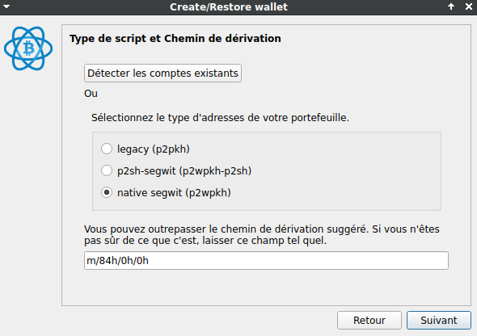


## Passphrase

The passphrase is an optional feature that adds an extra layer of security to your wallet. When set, it is combined with your BIP39 seed to generate a unique set of keys. 

**Without the correct passphrase, the wallet cannot access the same addresses or funds**, so it is crucial to remember or securely store it.

## Random Number Generator

In the Bitcoin Card Wallet project, **random number generation is a critical component** for creating secure private keys and ensuring the overall security of the wallet.

The project uses **multiple sources of entropy to generate random numbers**, which are then combined to form a single private key.

**Hardware, software, and user sources are used** to ensure high randomness in the private key generation process.

### Three sources of entropy

```cpp
// mbedTLS's Deterministic Random Bit Generator seeded with hardware generated entropy and a custom string
std::vector<uint8_t> CryptoService::generateRandomMbetls(size_t size) {
    // Init context
    mbedtls_ctr_drbg_context ctr_drbg;
    mbedtls_entropy_context entropy;
    mbedtls_ctr_drbg_init(&ctr_drbg);
    mbedtls_entropy_init(&entropy);

    // Seed the DRBG
    const char *pers = "cardputer_card_wallet_random_generator";
    mbedtls_ctr_drbg_seed(&ctr_drbg, mbedtls_entropy_func, &entropy,
                          reinterpret_cast<const unsigned char*>(pers),
                          strlen(pers));

    // Get random
    std::vector<uint8_t> randomData(size);
    mbedtls_ctr_drbg_random(&ctr_drbg, randomData.data(), size);

    // Release context
    mbedtls_ctr_drbg_free(&ctr_drbg);
    mbedtls_entropy_free(&entropy);

    return randomData;
}

// Hardware Random Number Generator (HRNG) to produce random numbers from hardware
std::vector<uint8_t> CryptoService::generateRandomEsp32(size_t size) {
    // Get entropy from esp32 HRNG
    std::vector<uint8_t> randomData(size);
    bootloader_random_enable();
    esp_fill_random(randomData.data(), randomData.size());
    bootloader_random_disable();
    
    return randomData;
}

// Software based random numbers
std::vector<uint8_t> CryptoService::generateRandomBuiltin(size_t size) {
    // Builtin esp_random
    std::vector<uint8_t> randomData(size);
    size_t i = 0;

    while (i < size) {
        // 32 bits integer
        uint32_t randVal = esp_random();

        // Split randVal into 4 parts
        size_t bytesToCopy = std::min(size - i, static_cast<size_t>(4));
        memcpy(randomData.data() + i, &randVal, bytesToCopy);

        i += bytesToCopy;
    }

    return randomData;
}
```

### Collecting entropy from user inputs 
```cpp
void EntropyContext::tick() {
    auto now = std::chrono::high_resolution_clock::now();

    // Calculate the delta between the last input tick and now
    if (lastTickTime.time_since_epoch().count() != 0) {
        auto delta = std::chrono::duration_cast<std::chrono::nanoseconds>(now - lastTickTime).count();
        add(delta);
    }

    lastTickTime = now; // Update the last tick time
}
```

### Mixed and hashed to form the final private key
```cpp
std::vector<uint8_t> CryptoService::generatePrivateKey(size_t keySize) {
    // Get entropy from hardware and software
    auto entropyEsp32 = generateRandomEsp32(keySize);
    auto entropyMbedtls = generateRandomMbetls(keySize);
    auto entropyBuiltin = generateRandomBuiltin(keySize);

    // Get entropy from user action
    auto entropyUser = entropyContext.getAccumulatedEntropy();

    // Control size
    if (entropyEsp32.size() != keySize || entropyMbedtls.size() != keySize || entropyBuiltin.size() != keySize) {
        throw std::runtime_error("Failed to generate sufficient entropy");
    }

    // Process SHA256 on the user entropy
    auto hashedEntropyUser = hashSha256(entropyUser, keySize);

    // Mix entropy with XOR
    auto mixedKey = mixEntropy(entropyMbedtls, entropyEsp32, 
                                               entropyBuiltin, hashedEntropyUser);
    // Process SHA256 on the result
    auto privateKey = hashSha256(mixedKey, keySize);

    return privateKey;
}
```

## License and Disclaimer
This project is provided under the MIT License, allowing free use, modification, and distribution under its terms. By using this software, you agree to the following:

- **No Warranty**: This software is provided "as is," without any warranties of any kind, whether express or implied. This includes, but is not limited to, fitness for a particular purpose, security, or absence of defects.
- **No Liability**: The authors and contributors of this software are not responsible for any loss, damage, or claims arising from the use of this software. This includes but is not limited to financial loss, theft of funds, or failure of the application to perform as intended.
- **User Responsibility**: It is your responsibility to safely back up your seed phrase, private keys, and any other sensitive information generated by this software. The seed phrase is not saved on the device, and loss of this information will result in the inability to access funds.
- **Personal Use**: This software is intended for educational and personal use only.

***By using this software, you acknowledge and accept these terms.***